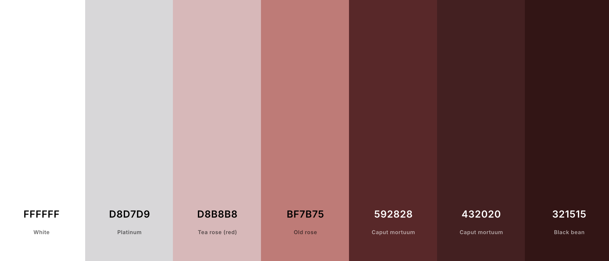

# **La Luna**

## **Introduction**
Welcome to La Luna, the online gateway to an exceptional fine-dining experience. Designed to reflect the elegance and sophistication of the restaurant itself, this website ensures that every visitor’s journey—from exploring our offerings to reserving a table—is as delightful and seamless as the dining experience at La Luna.

## **Table of Contents**

## **Planning**

### Strategy

#### Site Aims

The aim of this webiste was to provide a sleek, intuitive experience for users who wish to learn about the La Luna restaurant, make a reservation, and ask questions. 

Users would be able to create an account through which they can create, edit and modify bookings. Admin users could also keep track of bookings through the admin dashboard.

#### Opportunities

Below are the main opportunities that arose when planning my project. The scores given to each opportunity were influenced by the project timeframe, familiarity with the languages and frameworks used, and project scope. Opportunities ranked lowly are only done so under the lens of this iteration and will be rescored in future iterations.

Opportunity | Importance | Viability/Feasibility
---|:---:|:---:|
Learn about restaurant history | 4 | 5
See images of the restaurant | 3 | 5
Display a menu with all relevant details | 5 | 5
Allow menu to be edited and updated by admin | 1 | 1
Display contact info | 5 | 5
Create an account to keep to track of bookings | 5 | 5
Give bookings 'active/expired' labels for better UX | 5 | 5
Allow users to create, edit and delete bookings | 5 | 5
Allow users to make multiple bookings | 5 | 5
Allow uses to access social media links | 4 | 5
Users can send a message via a contact form | 4 | 5
Display a map of the location | 2 | 2 
Allow admin to add and remove items from the menu | 2 | 2
Create an a newsletter to be distributed to account holders | 1 | 2
Allow users to make a booking without creating an account. | 1 | 1
Allow admin users to view and filter bookings made by users. | 5 | 5
Allow admin users to view and filter contact form submissions. | 5 | 5
Allow admin users to respond to respond to contact form messages in the dashboard. | 3 | 1
Restrict capacity to 40 people at any one time | 5 | 5
Add a review section for registered customers. | 1 | 2
Google Maps API. | 1 | 1
---------- | --- | ---
**TOTAL** | **72** | **77**

### Scope

I divided these opportunities into categories under the MoSCoW headings for clarity.

* Must Have:
    * See a full menu with allergens.
    * See the history of the establishment.
    * See contact info.
    * Instantly make a booking and see what times and dates are available for bookings.
    * Instantly modify a booking.
    * Instantly delete a booking.
    * Make multiple bookings.
    * Create an account to keep track of bookings.
    * Admin can view and filter bookings made by users.
    * 40 people capacity.

* Should Have:
    * View images of the restaurant so I know what the atmosphere is like.
    * Have social media links easily accessible.

* Could Have:
    * Send a message to the restaurant staff if I have a query.
    * Dynamic menu.
    * Allow menu to be updated by staff.
    * Admin users can respond to contact form messages in the dashboard.

* Won't Have:
    * Review section.
    * Allow users to create and modify bookings without creating an account by having a booking ID.
    * Google Maps API.
    * Newsletter distribution.

### Structure

#### User Stories

As a user...
* I want to experience an intuitively laid-out website.
* I want to see images so I know what atmosphere to expect.
* I want to create an account to keep track of my bookings.
* I want to make, edit, and delete bookings without contacting the restaurant directly.
* I don't want to be able to make reservations on days when they are closed or past closing hours. 
* I want to be able to contact the restaurant by phone, email, and message through their website.
* I want to easily access social media links from each page.
* I want to easily access contact information from each page.
* I want to learn about the restaurant's history.
* I want to view a menu with prices and any relevant allergens.

As a manager/owner...
* I want to provide a clutter-free website so customers aren't overwhelmed.
* I want to convey the 'vibe' of the establishment via images on the homepage so users know what to expect.
* I want to display a menu with allergen information and prices. 
* I want to allow users to create an account.
* I want users to have full control over bookings through said account so that staff can prioritise their time.
* I want users to know that tables will be given for two hours.
* I want users to have several means of contacting the restaurant (contact form, phone number, email). 
* I want users to not make reservations for more than 8 people via the booking form.
* I want an admin page where view bookings, user account details, and contact form submissions.
* I want users to have access to our social media pages via the footer.
* I want users to have access to our contact details via the footer. 
* I want users to be able to learn about the history of the establishment on the homepage.
* I want staff to be able to access all form submissions via the admin page.
* I want staff to be able to see a list of bookings made and to be able to organise them by different criteria (validity, name, date, etc).
* I want staff to be able to see a list of contact form submissions. (The details of which can be copied and replied to using the company email account.)

### **Skeleton**
#### Wireframes
* [Homepage wireframes](docs/wireframes/homepage_wireframe.png)
* [Menu wireframe](docs/wireframes/menu_wireframe.png)
* [Bookings wireframe](docs/wireframes/booking_form_wireframe.png)
* [My Bookings wireframe](docs/wireframes/booking_list_wireframe.png)
* [Homepage wireframe](docs/wireframes/menu_wireframe.png)

The 'Our Story' section deisgn wasn't confirmed at this point as I wanted to make the list appear in a dynamic way and some character to the page. Therefore, I planned out a space for it while I research for ways to display it. In the end I used a [timeline template](https://codepen.io/chriswrightdesign/pen/XJzNBN/) from codepen and adjusted the colours to match my project. 

#### Database

Below is the ERD for my database schema. I opted to user the default user model from the AllAuth library.

The most extensive model is by far the booking model, that required user validation before accessing the form. 
The contact model behaves in isolation and behaves separarely from the booking model.

Below are my two plans for the models I created.

* [Booking Model](docs/database-erd/booking_plan.png)
    * The booking model varied once implementing AllAuth as well as customising the time slot calculation, as you can see in the final model below. 
* [Contact Model](docs/database-erd/contact_plan.png)
    * The contact model remained the same as planned, save for the ID which is automatically generated by Django to identify each contact submission. 

    * Above is the final and comprehensive ERD. 

### **Surface**
#### Colour Scheme

Below is my colour scheme.

**Fonts**

The fonts used in my project are from Google Fonts.

* ['Italiana'](https://fonts.google.com/specimen/Lato) was used for primarliy for decorative, large text. 
* ['Lato'](https://fonts.google.com/specimen/Italiana?query=italiana) was used for smaller text and longer sentences so that the user has no difficulty reading it.

**Images**

Below are the images I used for the hero image and in the gallery section. 

* **Hero Image:**
    * [Hero image: Two men standing behind the bar of an open restaurant.](https://images.pexels.com/photos/5490933/pexels-photo-5490933.jpeg?auto=compress&cs=tinysrgb&w=1260&h=750&dpr=2)

* **Gallery Images:**
    * [Gallery image: A man working in a restaurant kitchen.](https://images.pexels.com/photos/14410382/pexels-photo-14410382.jpeg)
    * [Gallery image: Two people clinking glasses.](https://images.pexels.com/photos/4255489/pexels-photo-4255489.jpeg)
    * [Gallery image: Pasta being cut with a machine.](https://images.pexels.com/photos/4252785/pexels-photo-4252785.jpeg)
    * [Gallery image: Uplcose shot of pepperoni pizza.](https://images.pexels.com/photos/20844860/pexels-photo-20844860/free-photo-of-pizza-served-in-a-restaurant.jpeg)
    * [Gallery image: A man sprinkling flour on freshly cut pasta.](https://images.pexels.com/photos/4252779/pexels-photo-4252779.jpeg)
    * [Gallery image: Hands clapping to remove flour.](https://images.pexels.com/photos/784633/pexels-photo-784633.jpeg)

## **Features**
### **Base**

The following is an explanation of the features of the base.html file from which all (but the error (404 and 500) pages extend from.)

#### Logo
The 'La Luna' logo is displayed at the top of every page in a large white font. It remains in the centered across all screensizes. 

#### Navigation
The navgiation sits just under the logo in the header. The links are light-red in colour and change to an off-white colour when in the hovered state. Two lines also expand from the top and bottom of the hovered-over link for better UX. On larger screens, the navigation links are always visible and sit side by side. 
WHen the user is not authenticated (not logged in), they will see a 'Bookings' link. This changes when the user is signed in to a dropdown that reads 'Bookings' with a caret icon. When hovered over, the authenticated user can the access the 'Make booking' link (which brings them to the booking form) and the 'My Bookings' link which brings them to a list of their previously made bookings.
The navigation bar is not present on the error pages (404 and 500) to minimise the chances of more errors appearing. The users should be redirected to the homepage so that their navigation path is clear. 

#### Navigation (Smaller Screens)
On smaller screens, the navigation is replaced by a burger icon which expands when clicked/tapped. The navigation links expand vertically along the screen and have the same hover features as the large-screen navigation. The same logic occurs here in which logged out users will not have the dropdown option to access bookings, while logged in users will. 

#### Footer
Across all pages, the footer is broken into three columns that stack vertically as the screen narrows. The first section is the directory which is effectively a second navigation and provides all the same links. It also provides the same relevant user authentications actions (login, sign up, logout). The second column houses the social media links for X-Twitter, Instagram and Facebook. The third and final column is the Address column which provides a summary of the important contact details.

#### User Status
As previously mentioned, users can take actions via the header and/or the footer. There are links in both that will allow users to login, log out, or sign up depending on their authentication status at that time. 

### **Index/Homepage**

#### Our Story Section
This section provides a timeline which appears dynamically when the link is clicked. If the user scrolls down to this section, the information will be static as the animation only occurs when the page is refreshed (i.e. when the link at the top of the page is clicked). On smaller screens, the text wraps and stacks vertically.

#### Gallery Section
This section varies depending on screensize. On large screens, six images appear in two rows of three. On medium screens, the images reduce to three images vertically stacked with a more horizontal aspect ratio. On small screens, the images regain their vertical status but remain a vertically stacked set of three.

The images are borrowed from [Pexels.com](https://www.pexels.com/).

### **Menu**

The menu page displays hard-coded, static information. The menu background is a dark red-brown colour to make it easy to read as well as distinctive from the rest of the pages. There are no clickable links on this page.

### **Make Booking**
This page will not be visible to unathorised (logged out) users. Once the user is authorised, they can access this page. They will be able to view the booking form and create a new booking. 
At the top of the form is a link suggesting the user visit the 'my bookings' page if they are looking to view or edit an exisitng booking. 

The form itself has several inputs. The only one that is prepopulated is the email field for a more intuitve user experience. The field however is editable in case a user wants to make a booking for a third party. The name and phone fields are left blank for this reason too. 
Users are prevented from making a booking in the past, entering an invalid phone number or email, or booking when the restaurant is at max capacity. Error messages appear under the respective field(s) where the error occurred. 

When the user enters valid data and clicks the submit button, the user is redirected to the 'my bookings' page where they will see a success message.

All fields on the form are required.

### **My Bookings**
This page will not be visible to unathorised (logged out) users. 
When the user is logged in, they will be able to view, edit and delete previously made bookings. The page separates bookings into two sections, upcoming and expired.

The 'edit' button will return the user to a slightly modified version of the booking form. The form title and submit button prompt are modified to make it clear that the user is modifying a booking. When the edit is submitted, the user is returned to the 'my bookings' page with an sucess message alerting the user of the change. 

The delete button triggers a confirmation modal to check if the user's click/tap was intentional. The user has the option to cancel or confirm the delete. If they confirm, the 'my bookings' page will refreshed with the successful deletion message. 

### **Contact Us**
The contact page gives users (authenticated and unauthenticated) the opportunity to get in touch with the restaurant. The decision was made to give unauthorised users access to this form in case they forgot their log in information, if there is a problem with the form, if there is a language barrier, or if users are uncomfortable making phone calls. 

All fields on the form are required.

### **User Authentication Pages (Login, Log out, Register)**

All user pages are AllAuth default templates modified to match the style of the website. The sign in and sign up forms all have built-in validation, so the user cannot skip any fields or enter invalid information when creating an account or signing in. 
When signing out, the user will be brought to a confirmation page and asked once again if the want to sign out. If they dont want to, they can simpy click the navigation links above the message. If they confirm, they will be logged out and redirected to the homepage. Their user status will be accurately reflected in the top right of the page.

### **Admin Dashboard**

The admin dashboard is accessible by adding `/admin` to the end of the home/index link.

It is where the admin can access the submission from the booking and contact forms. 
The bookingsystem app houses all booking form submissions which users can organise through the various headings. The form inputs can all be used as filters, and each booking has an 'expired' check beside it. It will have a green tick if expired, otherwise a red 'x' if it's valid. Admin also has the ability to edit bookings if a user makes a request or accidentally creates a duplicate.
The contactsystem app houses all submissions made through the contact form. At a glance, admin users can only see a name, contact details, and a checkbox indicating if it has been resolved yet. To view the message, the user simply needs to click on the name of the submitter. The message is not part of the list display as it required the user to horizontal scroll.

Admin can also see a list of emails that are used to create an account and access a link to help users reset their password. 

The bottom two sections ('sites' and 'social accounts') were required to make the apps work but hold no functionality at this time. In future iterations, I will make use of it. 

## **Future Development**

There were some features that were not implemented due to time, skill and project scope.

In the future, I would like to include:

|  |  |
|:---  |:---  |
| Automatic Email Upon Booking | I want a confirmation email to be sent when a user creates or edits a booking so that they don't have to sign in each time to view it. I feel this would provide a more pleasant experience for the user. *(This feature was implemented and successfully working for most of the development stage. Details are discussed in [TESTING.md](TESTING.md))* |
| Booking ID | I would like to add an option for the user to access their booking via a booking ID. This would prevent them having to create an account which some users can find tedious and time consuming. This would require an email function. |
| Update Menu | I would like to give the admin control over the menu. This would require implementing a menu model through which the menu could be updated by staff. |
| Review Section | Providing a section for reviews from websites like Tripadvisor or Google would give the restuarant more legitmacy and would likely have a positive affect on SEO rankings. |
| Social Account Log In | Allowing users to login or signup through an existing social account would streamline the process. |
| Deleted bookings | I would like to create a place on the admin dashboard where they can view deleted bookings. I will also consider if it is worth adding a similar display for the user to see. |
| Reply to Contact submissions via dashboard | At the moment, admin users have to copy the email from the submission and go over to their gmail account to reply. I would like to allow admin to send emails from the dashboard in order to streamline the process and limit the resources needed. |

## **Deployment**
Below are the steps I took to prepare my project for deployment on Heroku.

### 1. GitHub.
I created a new repsitory based off the Code Institute template [here](https://github.com/Code-Institute-Org/ci-full-template).

*If following the instructions below, please replace any all-cap words with names suitable for your project.*

With my project environment opened locally , I began by local setup by doing the following:

1. Added `env.py` to the `.gitignore` file to prevent it from being tracked.

2. Installed Django using:
    
    * `pip3 install Django~=4.2.16`.

3. Added requirements to `requirements.txt` with: 

    * `pip3 freeze local > requirements.txt`

4. I created my project with the built-in Django commands:

    * `django-admin startproject PROJECT_NAME .`

    * In my case: `django-admin startproject laluna .`

5. Then, within the project just created, I created my first app in the root directory:

    * `python3 manage.py startapp APP_NAME`
    * In my case: `python3 manage.py startapp bookingsystem`

6. Once created, I added 'bookingsystem' to th elist of installed apps in settings.py.

7. Migrate changes:
    * `python3 manage.py makemigrations --dry-run` is used to simulate what migrations would be created. It effectively is a preview. This step can be skipped.
    * `python3 manage.py makemigrations` generates the migration files based on changes made to models. This step cannot be skipped.
    * `python3 manage.py migrate` applies the migration files created in the previous step to the database, updating the schema. This step cannot be skipped.

8. Create a `.env` file using the `touch env.py` command to house sensitive information. (Double check this file has been added to the .gitignore file.)

9. In env.py, add the database URL. (In my case it was a PostgreSQL instance emailed to me by Code Institute.)
    * `import os`

        `os.environ.setdefault(`
            `"DATABASE_URL", "<your-database-URL>")`

10. Installed require packages:
    * `pip3 install dj-database-url~=0.5 psycopg2~=2.9`
    *  `pip3 freeze --local > requirements.txt`

11. Update settings.py:
    * `import os`
    * `import dj_database_url`
    * `if os.path.isfile('env.py'):`

        `import env`

12. Comment out default SQLite databse and replace with new database connection:
    * `DATABASES = {'default': dj_database_url.parse(os.environ.get("DATABASE_URL"))}`

### Heroku

The following steps were taken aftering signing into my Heroku account.

**1. Create a New Heroku App**

1. Navigate to the Heroku dashboard.
2. In the top-right corner, click New, then select 'Create new app'.
3. Provide a unique name for your app to be included in the URL.
4. For this project, the app was named 'la-luna'.
5. Choose the relevant region.

**2. Configure the Heroku App's Config Vars**

1. Locate the SECRET_KEY variable in your project’s settings.py file. 
2. In my case, there was an insecure key present, so I replaced it. 
    * Example: SECRET_KEY = 'SECRET_KEY'.
3. I generated a SECRET_KEY value to store safely in my env.py file.
4. In the Heroku dashboard, go to the Settings tab for your app.
5. Scroll down to the Config Vars section and click Reveal Config Vars.
6. Add a new config variable:
    * **Key:** SECRET_KEY
    * **Value:** The value you stored in your env.py file.

**3. Add a Database to the Heroku App**

1. In your Heroku dashboard, open your app and go to the Settings tab. Click Reveal Config Vars.
2. If Heroku has automatically added a DATABASE_URL:
    1. Go to the Resources tab.
    2. Delete the Heroku Postgres add-on by selecting Delete Add-on.
3. Add your PostgreSQL URL from env.py as a new config variable:
    * **Key:** `DATABASE_URL`
    * **Value:** `given-database-url`

**4. Setting up settings.py**
1. At the top of your settings, add the following:
    * `import os`

        `if os.path.isfile('env.py'):`

        `import env`

        `_ = env`
    * `SECRET_KEY = os.environ.get("SECRET_KEY")`
2. Include the following in the templates array:
    * `'DIRS':[TEMPLATES_DIR],'`

**5. Deployment Prep: Part 1**

1. Install gunicorn (serves as a bridge between your Django application and Heroku):
    * `pip3 install gunicorn~=20.1`
2. Add Gunicorn to the requirements.txt file:
    * `pip3 freeze --local > requirements.txt`
3. At the root directory of your project, create a file named Procfile with no file extension:
    * `touch Procfile`
4. Open the Procfile and declare the process as web, specifying the start command:
    * `web: gunicorn codestar.wsgi`
5. Update settings for deployment:
    * `DEBUG = False`
    * `ALLOWED_HOSTS = ['local-environment-url', '.herokuapp.com']`
        - Your GitHub local environment can be simply found by running your server locally using `python mange.py runserver` and copying the url.

**6. Deployment Prep: Part 2**

1. Install and setup white noise:
    * `pip3 install whitenoise~=5.3.0`
2. Add WhiteNoise to `requirements.txt`:
    * `pip3 freeze --local > requirements.txt`
3. Open you settings.py file and add WhiteNoise Middleware in the `MIDDLEWARE` list **directly after `SecurityMiddleware`**:
    * `'whitenoise.middleware.WhiteNoiseMiddleware',`
3. Configure static files by setting a `STATIC_ROOT` path in settings.py.
    * `STATIC_ROOT = os.path.join(BASE_DIR, 'staticfiles')`
    * Collect static files into the `staticfiles` directory by running:
        
        `python3 manage.py collectstatic`
4. Check Pythin version by running this command:
    * `python3 -V`
    * Example output: `Python 3.9.17`.
5. Create a .python-version File (instead of a runtime.txt file as recommended by Heroku). 
6. Add your python verion into this file.
    * `python 3.9.17`

You can now deploy your app and review the deployed app.

## **Tech used**
* Python
    * The project's dependencies can be seen in the `requirements.txt` file.

* Django
    * The Python framework used for the project.
    * Django AllAuth was used to handle all user authentication (sign up, sign in, sign out).

* Heroku
    * Heroku was used for deployment and publishing.

* CSS
    * Utilized both during development and in deployment.

* HTML
    * HTML formed the foundation for the layout of all templates.

* JavaScript
    * JavaScript was employed for DOM manipulation and backend communication to manage CRUD operations on the database.

* Jinja
    * Jinja was used as the templating engine to inject views.py logic and models.py data into templates for display.

* Bootstrap
    * Bootstrap was used to streamline styling code.

* Font Awesome
    * Social media icons in the footer come from Font Awesome.

## **Credits**

* The app was built in VSCode and stored in a Github repository.
* I used [this article](https://blog.shahryartayeb.com/post/automatically-generate-erd-of-your-django-models-21) to guide me through generating a diagram for my ERD.
* [Am I Responsive?](https://ui.dev/amiresponsive) was used for taking responsive test screenshots in tandem with an iPhone, iPad and Macbook.
* [Coolors.co](https://coolors.co/) was used to create my colour palette.
* Timeline animation template from [codepen.io](https://codepen.io/chriswrightdesign/pen/XJzNBN/).
* Fonts were taken from Google Fonts: [Italiana](https://fonts.google.com/specimen/Italiana?query=italiana) and [Lato](https://fonts.google.com/specimen/Lato).
* All images were borrowed from [pexels.com](https://www.pexels.com/collections/italian-restaurant-sohwnnr/).
* Procreate was used to draw up the wireframes. 
* Miscellaneous References:
    * [Django documentation](https://docs.djangoproject.com/en/5.1/)
    * [Bootstrap documentation](https://getbootstrap.com/)
    * [Code Institute Learning Platform](https://codeinstitute.net/ie/)
